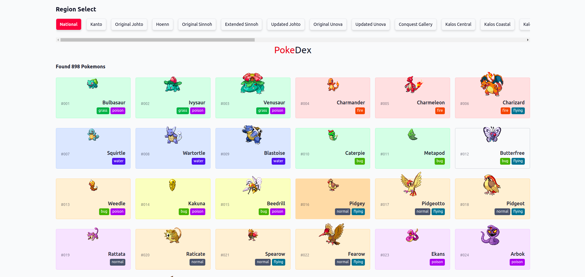
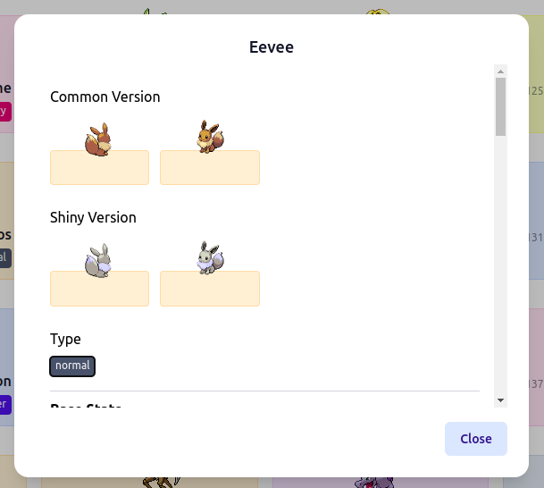
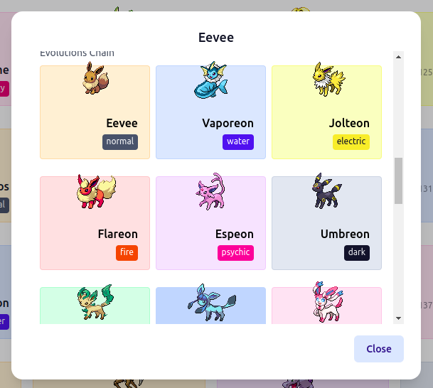

# Pokedex Web 
#### using PokeApi & TailwindCSS
Browse Pokemon by Region, click to see the species detail and evolution.

## Preview
#### [https://ax-pokedex.netlify.app](https://ax-pokedex.netlify.app)

#### Screenshot

| Pokemon Species | Pokemon Evolution |
| ---------------- | ---------------- |
|  |  |
## How to Run

```bash
npm install
npm run dev
# or
yarn dev
```

Open [http://localhost:3000](http://localhost:3000) with your browser to see the result.

